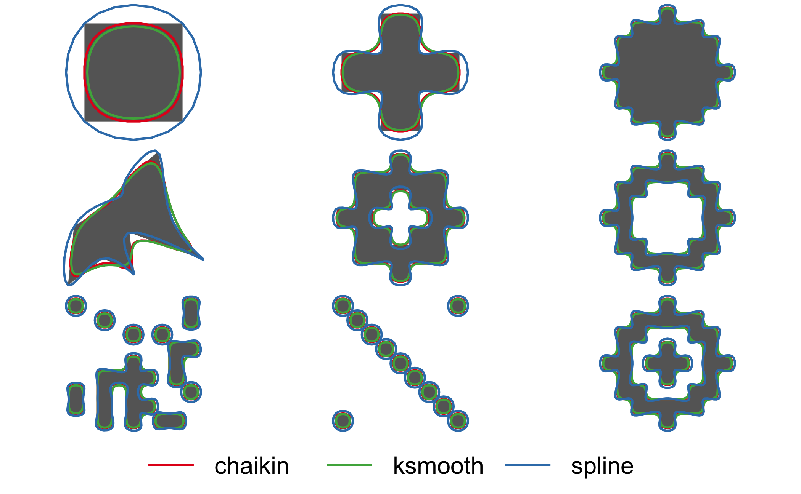

<!-- README.md is generated from README.Rmd. Please edit that file -->
smoothr
=======

`smoothr` offers a variety of tools for smoothing and tidying spatial
features (i.e. polygons and lines) to make them more aesthetically
pleasing, especially when converting raster data to vector format. This
package offers support for both `sp` and `sf` spatial objects. The
following smoothing methods are available:

-   **Chaikin's corner cutting algorithm**: smoothing using Chaikin's
    corner cutting algorithm, which iteratively replaces every point by
    two new points: one 1/4 of the way to the next point and one 1/4 of
    the way to the previous point. This method applies a moderate amount
    of smoothing of sharp corners without extensive generalization.
-   **Kernel smoothing:** smoothing using Gaussian kernel regression via
    the `ksmooth()` function. This approach first densifies the feature
    (i.e. adds more vertices) then applies the kernel smoothing. Kernel
    smoothing simultaneously smooths and generalizes curves, and can be
    tuned to produce extensively smoothed curves.
-   **Spline interpolation**: smoothing using spline interpolation via
    the `spline()` function. This method interpolates between existing
    vertices and should be used when the resulting smoothed feature must
    pass through the vertices of the input feature.

In addition to these smoothing functions, `smoothr` offers functions for
filling polygon holes and dropping line and polygon fragments based on a
size threshold, as well as densification (i.e. adding additional
vertices along curves).

Installation
------------

    # install from cran with
    install.packages("smoothr")

    # or install the development version from github with
    # install.packages("devtools")
    devtools::install_github("mstrimas/smoothr")

Usage
-----

Two example feature sets are included in this package. `jagged_polygons`
contains 9 polygons with sharp edges for smoothing, some have holes and
some are multipart polygons. We can smooth these using the different
methods available and plot a comparison:

    library(sf)
    library(smoothr)
    par(mar = c(0, 0, 0, 0), oma = c(4, 0, 0, 0), mfrow = c(3, 3))
    p_smooth_chaikin <- smooth(jagged_polygons, method = "chaikin")
    p_smooth_ksmooth <- smooth(jagged_polygons, method = "ksmooth")
    p_smooth_spline <- smooth(jagged_polygons, method = "spline")
    for (i in 1:nrow(jagged_polygons)) {
      plot(st_geometry(p_smooth_spline[i, ]), col = NA, border = NA)
      plot(st_geometry(jagged_polygons[i, ]), col = "grey40", border = NA, add = TRUE)
      plot(st_geometry(p_smooth_chaikin[i, ]), col = NA, border = "#E41A1C", lwd = 2, add = TRUE)
      plot(st_geometry(p_smooth_ksmooth[i, ]), col = NA, border = "#4DAF4A", lwd = 2, add = TRUE)
      plot(st_geometry(p_smooth_spline[i, ]), col = NA, border = "#377EB8", lwd = 2, add = TRUE)
    }
    par(fig = c(0, 1, 0, 1), oma = c(0, 0, 0, 0), new = TRUE)
    plot(0, 0, type = "n", bty = "n", xaxt = "n", yaxt = "n", axes = FALSE)
    legend("bottom", legend = c("chaikin", "ksmooth", "spline"),
           col = c("#E41A1C", "#4DAF4A", "#377EB8"),
           lwd = 2, cex = 2, box.lwd = 0, inset = 0, horiz = TRUE)

`jagged_lines` contains 9 lines with sharp edges for smoothing, some are
closed loops requiring special treatment of the endpoints and some are
multipart lines. For variety, let's smooth these using spline
interpolation:

    par(mar = c(0, 0, 0, 0), oma = c(4, 0, 0, 0), mfrow = c(3, 3))
    l_smooth_chaikin <- smooth(jagged_lines, method = "chaikin")
    l_smooth_ksmooth <- smooth(jagged_lines, method = "ksmooth")
    l_smooth_spline <- smooth(jagged_lines, method = "spline")
    for (i in 1:nrow(jagged_lines)) {
      plot(st_geometry(l_smooth_spline[i, ]), col = NA)
      plot(st_geometry(jagged_lines[i, ]), col = "grey20", lwd = 3, add = TRUE)
      plot(st_geometry(l_smooth_chaikin[i, ]), col = "#E41A1C", lwd = 2, lty = 2, add = TRUE)
      plot(st_geometry(l_smooth_ksmooth[i, ]), col = "#4DAF4A", lwd = 2, lty = 2, add = TRUE)
      plot(st_geometry(l_smooth_spline[i, ]), col = "#377EB8", lwd = 2, lty = 2, add = TRUE)
    }
    par(fig = c(0, 1, 0, 1), oma = c(0, 0, 0, 0), new = TRUE)
    plot(0, 0, type = "n", bty = "n", xaxt = "n", yaxt = "n", axes = FALSE)
    legend("bottom", legend = c("chaikin", "smooth", "spline"),
           col = c("#E41A1C", "#4DAF4A", "#377EB8"),
           lwd = 2, cex = 2, box.lwd = 0, inset = 0, horiz = TRUE)

### Other goodies

`smoothr` contains a handful of other tools to help clean up spatial
features and make them look cleaner and more aesthetically pleasing.

-   `densify()` (and it's alias `smooth(x, method = "densify")`)
    densifies lines and polygons, adding additional vertices along line
    segments.
-   `drop_crumbs()` removes small lines or polygons based on a length or
    area threshold.
-   `fill_holes()` fills (i.e. removes) holes from polygons when they
    are below a given area threshold.

See the documentation for these functions for full details.

Code of Conduct
---------------

Please note that this project is released with a [Contributor Code of
Conduct](CODE_OF_CONDUCT.md). By participating in this project you agree
to abide by its terms.

Contributing
------------

To contribute to the development of this project please refer to the
[guidelines](CONTRIBUTING.md).
